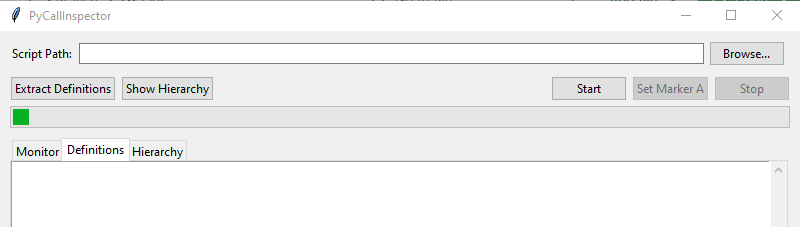

# PyCallInspector



PyCallInspector is a cross-platform tool for monitoring and profiling Python scripts. It captures and lists all function calls in your own `.py` files (excluding standard library and site-packages), providing a clear summary at the end of execution or upon manual stop.

---

**Why this is perfect for your workflow:**  
When working within a large codebase, you need to pinpoint errors in seconds, extract only the minimal context, and paste it directly into an AI for debugging. With its marker-based filtering, flat function listing, and on-the-fly definition extraction, PyCallInspector delivers precisely that package—zero noise, zero complex configuration, and zero external dependencies.


## Features

- **Function Call Tracing**
  Captures every function call in your project files during script execution.

- **Detailed Summary & Hierarchy**
  Outputs a sorted list of called functions and a call hierarchy tree with file paths and line numbers.

- **Marker-Based Filtering (GUI Only)**
  Allows setting Marker A and Marker B during execution via a dedicated button. The final **"Aufgerufene Funktionen" summary**, the **"Aufrufhierarchie"** output (in the Monitor tab), and the **"Extract Definitions"** view (in the Definitions tab) are filtered to show only the functions and calls that occurred between these markers.

- **`<genexpr>` Filtering**
  Automatically filters out repetitive calls to internal generator expressions (`<genexpr>`) from the summary and hierarchy views for better readability.

- **Graceful Stop**
  - **Unix/Linux/macOS**: Clean interruption via `SIGINT`/`SIGTERM` (CLI) or stop button (GUI).
  - **Windows**: Stop-file watcher signals a clean shutdown (triggered by GUI stop button).

- **GUI and CLI Modes**
  - **GUI**: Simple Tkinter interface with file picker, live log view, Start/Stop/Marker controls, and context menus.
  - **CLI**: Run headless in terminal (Marker feature not available in CLI).

- **Context Menu Actions**
  Right-click menus in the GUI provide options like "Copy" and "Select All" for easy text handling.

## Requirements

- **Python 3.6+** (includes `tkinter` on most distributions)
- No additional pip packages required.

## Usage

### CLI Mode

```bash
python pycallinspector.py monitor your_script.py [script_arguments...]
```

Stop early with:
- **Linux/macOS**: `Ctrl+C`
- **Windows**: Use the GUI or manually create the stop file (path determined by GUI PID, usually in temp dir).

### GUI Mode

```bash
python pycallinspector.py
```

1.  **Browse**: Select the target `.py` file.
2.  **Start**: Begin profiling. The "Set Marker A" button becomes active.
3.  **Set Marker A (Optional)**: Click the "Set Marker A" button at the desired starting point in your script's execution.
4.  **Set Marker B (Optional)**: The button text changes to "Set Marker B". Click it again at the desired ending point.
5.  **Clear Markers (Optional)**: The button text changes to "Clear Markers". Click it to reset both markers if you want to capture the full output or restart marker selection.
6.  **Stop**: Interrupt the script. The summary and hierarchy in the Monitor tab will be filtered based on the markers.
7.  **Extract Definitions**: Click this button *after* stopping. The Definitions tab will show only the definitions of functions/classes that were called between the markers (if markers were set during the last run). If no markers were set or cleared, all definitions are shown.
8.  **Show Hierarchy**: Click this button *after* stopping to view the filtered call hierarchy in the Hierarchy tab (same content as in the Monitor tab's summary).
9.  **Right-click**: Use context menus in output areas for Copy/Select All.

**Marker Filtering Logic:**
- **No markers set:** Shows the full summary, hierarchy, and all definitions.
- **Only Marker A set:** Shows the summary, hierarchy, and definitions for calls from Marker A to the end.
- **Marker A and B set:** Shows the summary, hierarchy, and definitions for calls strictly between Marker A and Marker B.

## Known Limitations

- **Compiled Binary (.exe) Issues**: Currently, running PyCallInspector as a compiled executable (e.g., created with PyInstaller) has known limitations. Specifically, it may fail to monitor target scripts that import standard Python libraries (like `json`, `os`, etc.), often resulting in `ModuleNotFoundError`. This seems to be caused by complex interactions between Python's profiling mechanisms (`sys.setprofile`), the way the target script is executed (`runpy`), and how PyInstaller bundles libraries for subprocesses.
- **Recommendation**: For reliable monitoring, especially of scripts with various imports, it is **strongly recommended to run PyCallInspector directly from its source code** (`python pycallinspector.py`) rather than as a compiled binary until a robust solution for the binary version is found.

## Example Output (Filtered, Markers A & B Set)

This example shows the **Monitor tab output** when Marker A was set after `phase1()` and Marker B was set after `phase2_part1()`. Only `phase2_part1()` was called between the markers.

```
[Monitor] Starte /home/ubuntu/test_target_markers.py mit args: ["/home/ubuntu/test_target_markers.py"] via runpy
Starting marker test target...
Entering Phase 1...
Exiting Phase 1.
  Entering Phase 2, Part 1...
[Monitor] Marker A gesetzt bei Index 5
  Exiting Phase 2, Part 1.
  Entering Phase 2, Part 2...
[Monitor] Marker B gesetzt bei Index 6
  Exiting Phase 2, Part 2.
Entering Phase 3...
Exiting Phase 3.
Marker test target finished.
[Monitor] Ziel-Skript normal beendet.
[Monitor] Profiling gestoppt (finally).

🧠 Aufgerufene Funktionen (aus eigenen .py-Dateien im markierten Bereich):
 - phase2_part1()  @ test_target_markers.py:9

🗂 Aufrufhierarchie (zwischen Markern):
    - phase2_part1()  @ test_target_markers.py:9
```
In this scenario, clicking "Extract Definitions" would show only the source code for the `phase2_part1` function in the Definitions tab.

(Note: `<genexpr>` calls are also automatically filtered out)

## Contributing

1. Fork the repo.
2. Create a branch (`git checkout -b feature/...`).
3. Commit and push.
4. Open a Pull Request.

## License

MIT License—see [LICENSE](LICENSE).

